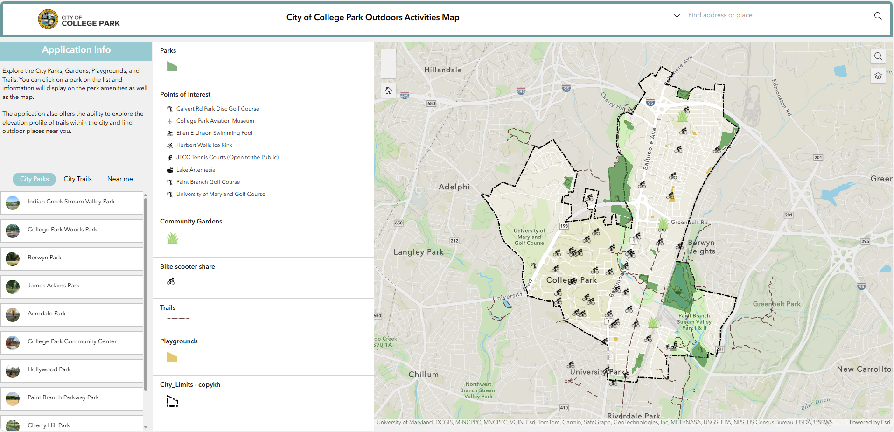
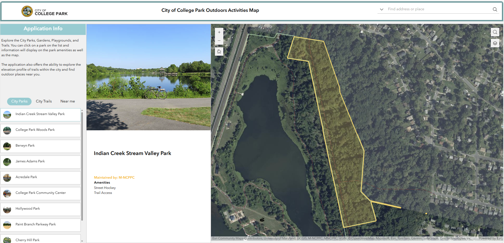
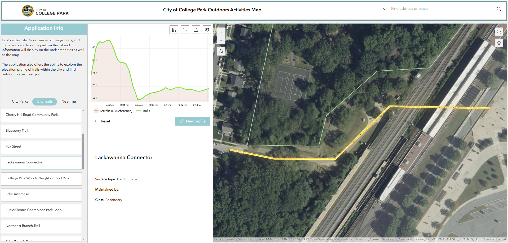
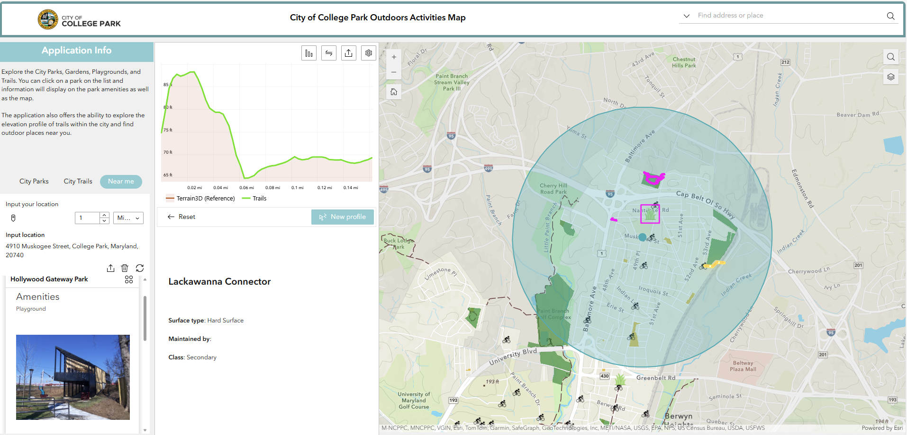
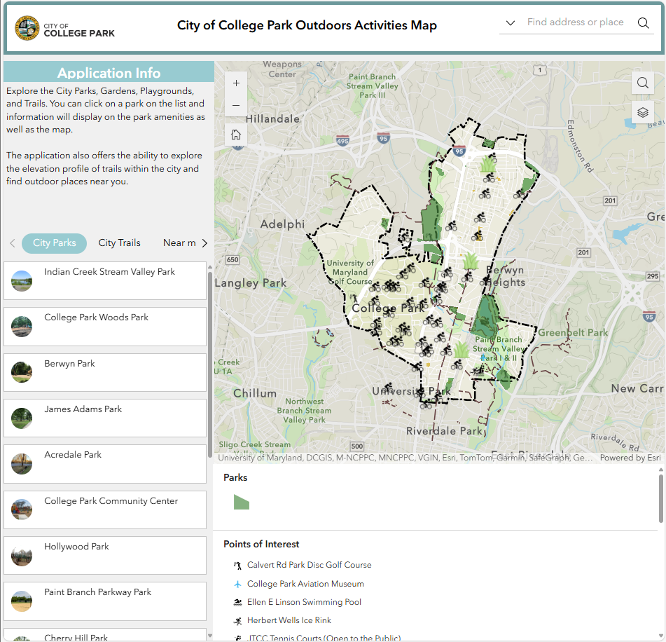
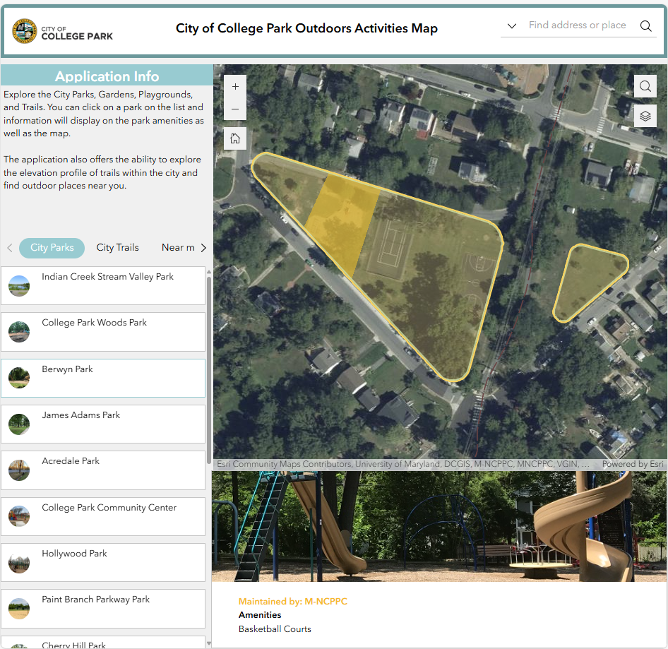
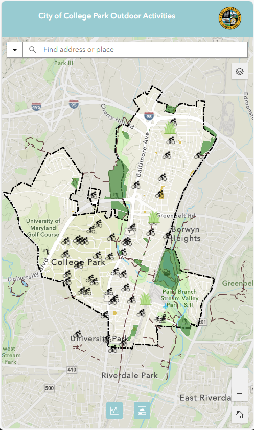

# College Park Parks and Recreation Experience Builder data prep

Data Preparation for College Park Parks and Recreation experience builder for ArcGIS.
This repository contains the data preparation process to get parks and recreation boundaries ready for display.

# Experience builder result

The output of this work can be seen here [Experience Builder](https://experience.arcgis.com/experience/bca92f7395ef48be9e9305f8dcd4b0a9)

## Main view

### Parks

The users will be greeted to the main page. With a description of the application function. Then, they can browse the existing parks, click through them and zoom. After clicking, a descriptive card will be triggered.

### Trails

Users will also be able to check trails and explore their elevation profile.

### Near me

For discoverage, the near me function was added.

## Tablet and Mobile

### Tablet

For tablet view, the discover section is moved to the bottom.

### Mobile

For mobile, the view switches to full map.

